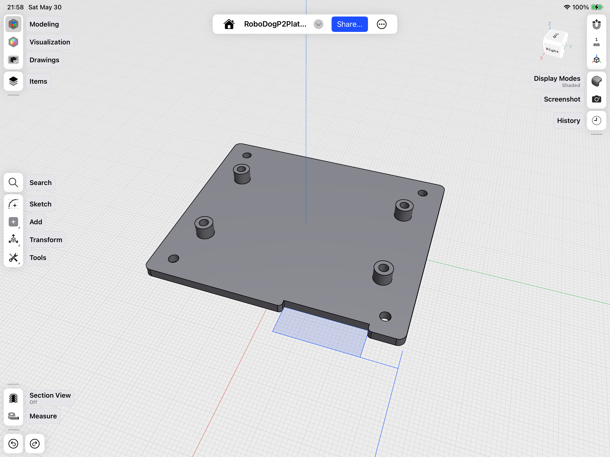

# Hardware Setup — Mounting the P2 on the Robot Dog

A photo walk-through of how the **Propeller 2 (P2)** assembly was built and mounted in
place of the Raspberry Pi on the Freenove FNK0050 Robot Dog.

Three phases:

1. [Modeling the base](#1-modeling-the-base) — design and print the adapter plate.
2. [Assembling the P2 hardware](#2-assembling-the-p2-hardware-onto-the-base) — board + module onto the plate.
3. [Mounting on the robot](#3-mounting-on-the-robot) — drop it into the Pi's spot.

For the electrical side (power, signals, level-shifting) see
[`P2_MIGRATION_WIRING.md`](P2_MIGRATION_WIRING.md); the editable CAD (DXF + 3MF) lives
alongside this doc in this folder (see [`README.md`](README.md)).

---

## 1. Modeling the base

The adapter plate is modeled to match the Raspberry Pi's mounting footprint on the robot's
connection board, with raised standoff bosses positioned to carry the P2 Edge breakout
board. (Source model: `P2-platform/RoboDogP2PlateV2.3mf` — the V2 plate uses taller
standoffs.)

  

It took a few iterations to get the standoff height and hole alignment right. Here are
three printed test plates from that tuning process:

  

---

## 2. Assembling the P2 hardware onto the base

Everything laid out before assembly: the **P2 Edge Module (P2-EC32MB — 8 cores, 46 I/O,
32 MB)**, the **Parallax P2 Edge breakout board** (with its 5 VDC barrel jack and PropPlug
serial header), the printed mount plate, the screws / standoffs / hex nuts, and a couple of
screwdrivers.

  

First the breakout board is fastened to the plate's standoffs. The barrel jack and PropPlug
programming header sit along the top edge:

  

Then the P2 Edge Module seats into the breakout's edge connector:

  

Flipped over, you can see the hex nuts securing the board to the plate's standoffs (and the
PropPlug adapter peeking out at the left edge):

  

---

## 3. Mounting on the robot

With the Raspberry Pi removed, the robot's connection board is exposed and ready to receive
the P2 assembly:

  

The camera ribbon cable is taped down/insulated while working in the tight space:

  

And here's the finished result — the P2 assembly mounted where the Pi used to sit.

Seen from the **left**, the breakout board's edge faces forward: the 5 VDC barrel jack and
the PropPlug programming header sit right where they're easy to reach, and the P2's I/O
header runs along the side toward the robot's connection board:

  

From the **right**, you can see the P2 Edge Module itself standing proud on the breakout
board — the whole controller now rides in the Pi's old footprint while the legs, head-pan
servo, and ultrasonic "face" stay exactly as the kit shipped them:

  

---

## License

MIT License - See [LICENSE](../../LICENSE) for details.

---

*Part of the Iron Sheep Productions Propeller 2 Projects Collection*

---
