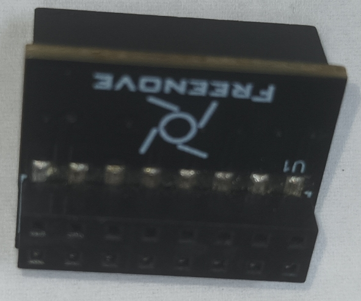
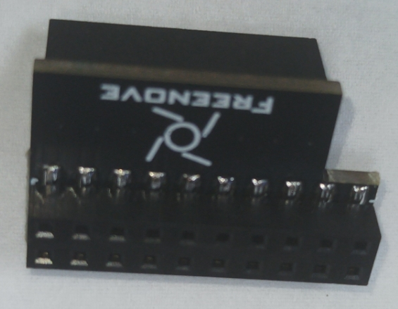

# DOCs — P2 Robot Dog documentation hub

Documentation for porting the **Freenove Robot Dog Kit (FNK0050)** from its stock Raspberry
Pi controller to a **Parallax Propeller 2**. Start at the top-level [project README](../README.md);
this page indexes everything under `DOCs/` and records how we reference the upstream Freenove
material.

## Top-level documents

| Document | What it is |
|----------|------------|
| [`RPI_GPIO_USAGE.md`](RPI_GPIO_USAGE.md) | The stock Pi pin/bus usage, reverse-engineered from the Freenove server source — device inventory, I²C addresses, servo channel map. |
| [`P2_FIRMWARE_THEORY_OF_OPS.md`](P2_FIRMWARE_THEORY_OF_OPS.md) | Theory of operation for the P2 firmware — the cog architecture and the basic→advanced motion progression. |
| [`DOG-LIKE-MOTION-STUDY.md`](DOG-LIKE-MOTION-STUDY.md) | Canine-biomechanics findings + the prioritized plan to make the gaits and poses more dog-like. |
| [`FUTURE-DIRECTIONS.md`](FUTURE-DIRECTIONS.md) | Candidate post-certification directions — speech, vision/pan-tilt head, P2 audio, BLE, active IMU balance. |
| [`pin-header.pdf`](pin-header.pdf) | The 40-pin connection-board header pin-out diagram (source in [`sources/`](sources/)). |

## Subfolders

| Folder | Contents |
|--------|----------|
| [`P2-platform/`](P2-platform/) | The physical swap — build walk-through, the migration wiring map, and the adapter-plate CAD. |
| [`spec/`](spec/) | The authoritative firmware specification. |
| [`policy/`](policy/) | Authoring conventions (the Spin2 guide). |
| [`plans/`](plans/) | Active sprint plan, bench playbook, and punch list (closed plans in `plans/archive/`). |
| [`dbg-display-theory/`](dbg-display-theory/) | How we build the P2 DEBUG-window display panels. |
| [`reference/`](reference/) | User guides for reused helper objects. |
| [`datasheet/`](datasheet/) | Vendor datasheets for the on-board parts (third-party). |
| [`Picture/`](Picture/) | Images referenced by the docs. |
| [`sources/`](sources/) | Editable diagram source files. |

## Upstream / external reference material — Freenove FNK0050

This port is built against Freenove's open-source kit. We reference that material in two
places, and **neither is covered by this project's MIT license**:

- **The Freenove Raspberry Pi Python stack** lives locally in `REF/` as **read-only**
  porting reference. It is **git-ignored** — never committed to this repo — and is the source
  the P2 drivers were reverse-engineered from (see [`RPI_GPIO_USAGE.md`](RPI_GPIO_USAGE.md)).
- **Kit photos** under [`Picture/`](Picture/) (the kit icon and the PCB-version photos) come
  from Freenove.

Freenove's materials are released under the
[Creative Commons Attribution-NonCommercial-ShareAlike 3.0 license](http://creativecommons.org/licenses/by-nc-sa/3.0/),
and the Freenove brand and logo are their property. Their upstream repository:
[Freenove_Robot_Dog_Kit_for_Raspberry_Pi](https://github.com/Freenove/Freenove_Robot_Dog_Kit_for_Raspberry_Pi).

> **This build targets connection-board PCB v1.0** (WS2812 LED data on GPIO18 — the
> `rpi_ws281x` path, not the v2.0 SPI0/GPIO10 path).

<table>
  <tr><th>PCB Version</th><th>Photo</th></tr>
  <tr>
    <td align="center"><b>V1.0</b> <em>(this build)</em></td>
    <td align="center"></td>
  </tr>
  <tr>
    <td align="center">V2.0</td>
    <td align="center"></td>
  </tr>
</table>

---

## License

The documentation in this `DOCs/` tree is authored by Iron Sheep Productions, LLC and
released under the MIT License — See [LICENSE](../LICENSE) for details. **Exceptions:** the
Freenove-sourced kit images and the third-party vendor datasheets noted above retain their
respective owners' licensing and are **not** covered by MIT.

---

*Part of the Iron Sheep Productions Propeller 2 Projects Collection*

---
